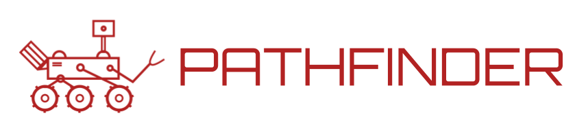

## Forward

In December of 1996, the world watched as the Mars Pathfinder spacecraft began its long journey to the red planet. It 
would carry the first-ever robotic rover to operate on the surface of Mars, Sojourner. It was designed as a technological 
demonstration, a short proof of concept of an economical way to land a remote controlled rover to another world.
Imagine being one of the engineers that worked on the Pathfinder or one of its many groundbreaking scientific 
instruments: the alpha proton X-ray Spectrometer, which determined the composition of rocks and soil; the three cameras 
that revealed the rover's rugged surroundings to observers over 200 million miles away; or the atmospheric sensors that 
measured the thin Martian atmosphere. On Independence Day 1997, this techological marvel &mdash; that *you* had a hand 
in building &mdash; has successfully reached Mars, spectacularly descending upon the surface with a parachute to slow 
its descent and an airbag system to cushion the inevitable impact. And then it starts beaming back data. 
Thousands of images. Over a dozen chemical analyses of rocks and soil. Traveling through space, between planets, from a 
rover running your code. The Pathfinder would go on to return 2.3 billion bits of information during the course of the 
next 3 months, before sending its final transmission on the 27th of September of that same year. It exceeded its 
original mission by eight weeks.

Pathfinder. What an appropriate name for that spacecraft. And, as you will see, the perfect name for this 
training project. 

## Introduction

Welcome to Cornell Mars Rover's controls software subteam. Our primary goal is to design and deliver a robust, fault 
tolerant, and intuitive rover controls system. We work with a few different technologies to achieve this. During the 
first part of your training, you got an overview of the Controls Software System Architecture. Now, let's get some 
hands-on experience by building your own virtual robotic turtle!

This project is a simplified replica of the sort of concepts and tools you'll use often on our subteam. To get started,
head over to the Wiki page!
